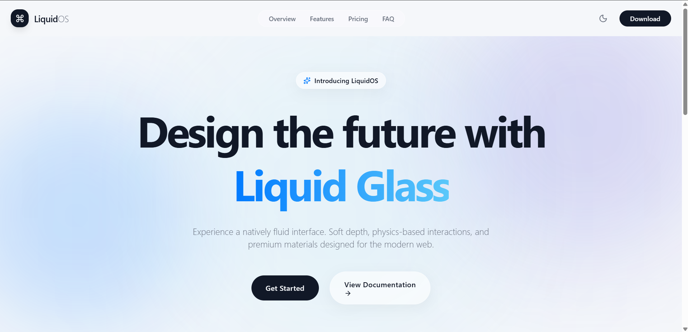

# 🌊 LiquidOS (Liquid UI Design System)

A futuristic landing page built with a **Liquid Glass (Glassmorphism 2.0)** design language. Inspired by modern Apple interfaces, fluid motion, soft transparency, dynamic lighting, and premium animations.



---

## 🎯 Goal

Create a visually stunning, interactive website that demonstrates advanced UI/UX principles while maintaining high performance and accessibility.

---

## ✨ Design Philosophy

* Minimal & Elegant
* Premium & Futuristic
* Soft Glass Effects (Backdrop blurs of 30-50px)
* Floating Components
* Fluid Animations (Physics-based springs)
* Depth & Transparency
* Clean Typography (-apple-system, Inter)
* Responsive Layout

---

## 🛠 Tech Stack

* **Framework**: Next.js 15 (App Router)
* **Styling**: Tailwind CSS v4
* **Motion**: Framer Motion
* **Scrolling**: Lenis (Smooth scrolling)
* **Theming**: Next-Themes (Light / Dark mode toggle)
* **Icons**: Lucide React

---

## 🚀 Getting Started

First, run the development server:

```bash
npm run dev
# or
yarn dev
# or
pnpm dev
# or
bun dev
```

Open [http://localhost:3000](http://localhost:3000) with your browser to see the result.

---

## 🎨 Color Palette

The app supports both Light Mode and Dark Mode out-of-the-box, controlled by CSS variables defined in `src/app/globals.css`.

**Dark Mode Variables**:
* `Background`: `#050816`
* `Primary`: `#4F8CFF`
* `Secondary`: `#8B5CF6`
* `Accent`: `#00D4FF`
* `Glass`: `rgba(255,255,255,0.08)`
* `Border`: `rgba(255,255,255,0.15)`
* `Text`: `#FFFFFF`
* `Muted Text`: `#A8B3CF`

**Light Mode Variables**:
* `Background`: `#F5F7FA`
* `Primary`: `#2563EB`
* `Secondary`: `#7C3AED`
* `Accent`: `#0284C7`
* `Glass`: `rgba(0,0,0,0.03)`
* `Border`: `rgba(0,0,0,0.1)`
* `Text`: `#0F172A`
* `Muted Text`: `#475569`

---

## 🧩 Components

* **`LiquidGlassCard`**: A reusable wrapper that provides the signature deep blur and translucent borders.
* **`MagneticButton`**: A heavily-animated button powered by Framer Motion that "sticks" and follows the user's cursor on hover.
* **`DynamicNavbar`**: A sticky header that changes transparency and blur dynamically based on scroll position, featuring a working Theme Toggle.
